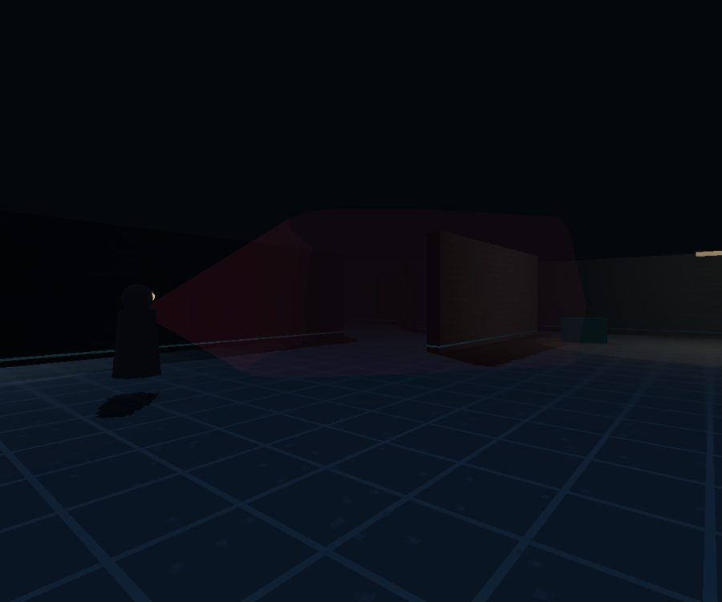
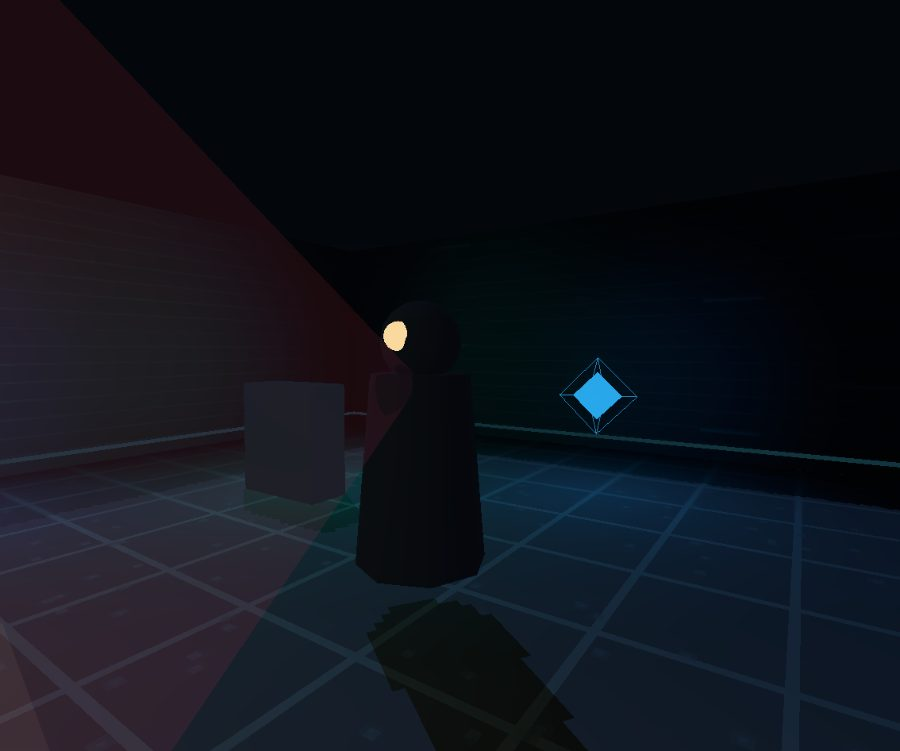

# Shadow Protocol

A tactical 3D stealth-action cyber-operations game built on three.js and Electron. Infiltrate, hack, and neutralize across 10 fortified sectors.

Each sector gates progress behind a real cyber-security objective, solved in an in-game toolset:

| # | Sector | Domain |
|---|---|---|
| 1 | The Perimeter | Risk Management & Access Control |
| 2 | The Cipher | Applied Cryptography |
| 3 | The Mainframe | Computer Systems Security |
| 4 | The Grid | Network & Infrastructure Security |
| 5 | The Breach | Digital Forensics & Attribution |
| 6 | The Patch | Software & Application Security |
| 7 | The Anonymizer | Information Privacy & PETs |
| 8 | The Nudge | Security Behaviour & Social Engineering |
| 9 | The Auditor | Security Management & Governance |
| 10 | The Mastermind | Synthesis & Intelligence |

## What's inside

- `src/engine.js` — first-person 3D engine: movement, crouch, takedowns, sentry vision cones, lighting and fog.
- `src/tools/` — simulated operator tools: shell, nmap, Wireshark, Burp, crypto, forensics, phishing, risk and privacy consoles.
- `src/content.js` — the 10-sector campaign: briefs, dialogue, level geometry and completion gates.
- `src/codex.js`, `src/teachdata.js` — the in-game field manual.
- `src/save.js`, `src/state.js` — progress and save data.




## Run

```sh
npm install
npm start
```

`node devserver.js` serves the game in a browser on port 4173. `npm run dist` builds the Windows installer.
